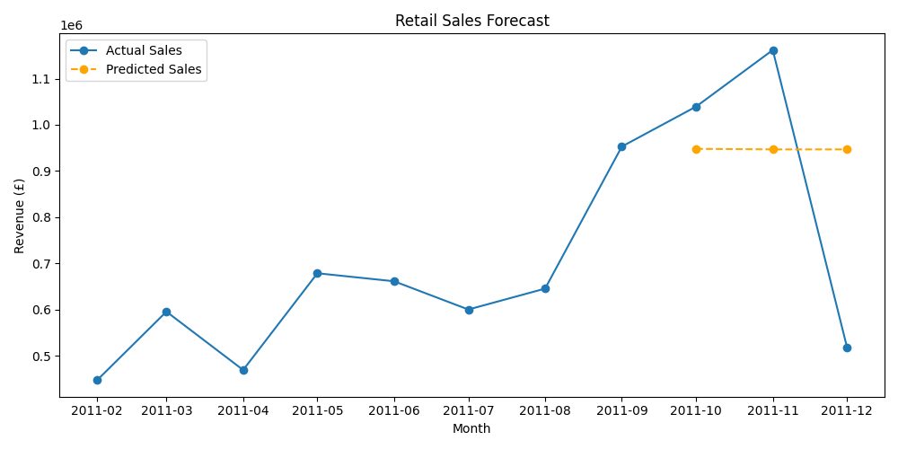

# 🛒 Retail Sales Forecasting

A machine learning pipeline built in Python to forecast monthly retail revenue.

## Dataset
- 540,000+ real UK retail transactions (2010–2011)
- Source: UCI Machine Learning Repository

## What it does
- Cleans and processes raw transaction data
- Engineers time-series features (lag variables, rolling averages)
- Trains a Gradient Boosting model to predict monthly revenue
- Visualises actual vs predicted sales

## Tools used
- Python, Pandas, Scikit-learn, Matplotlib

## Result

